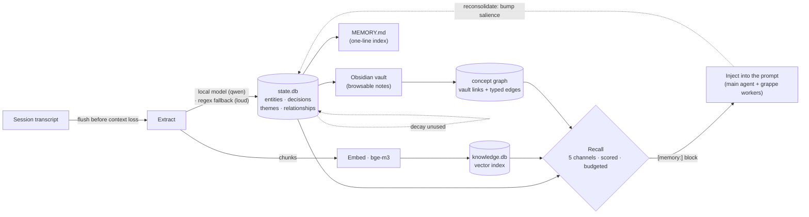

# openclaw-node

Installable package for deploying an OpenClaw node. Includes the full infrastructure stack:

- **Memory Daemon** — persistent background service managing session lifecycle, memory maintenance, Obsidian sync, and the consolidation cycle (the live unit execs `workspace-bin/memory-daemon.mjs`). The federation wiring (broadcaster/offerer/acceptor + subscriber + in-process consolidation scheduler) lives inside the same daemon behind `OPENCLAW_FEDERATION=1` — default off, dormant until multi-node federation lands
- **Federation / Grappe** — signed multi-node memory federation: grappes are signed-membership clusters of full OpenClaw nodes (`bin/openclaw-grappe.mjs`, `GRAPPE_REGISTRY` KV, join-token verified). The unit of federation is an OpenClaw, not a model
- **HyperAgent Protocol** — evidence-driven strategy loop: task telemetry, structured reflection, and human-gated strategy proposals
- **Mission Control** — Next.js web dashboard (kanban, timeline, graph visualization, memory browser)
- **Soul System** — multi-soul orchestration with trust registry and evolution
- **Skill Library** — 100+ skills for AI agent capabilities
- **Boot Compiler** — profile-aware boot artifact generation for multiple AI models
- **ClawVault** — structured knowledge vault with search and handoffs
- **Mesh Task Engine** — distributed task execution with Karpathy iteration (try → measure → keep/discard → retry)
- **Mechanical Enforcement** — path-scoped coding rules, dual-layer harness, role profiles with structural validation
- **Plan Pipelines** — YAML-based multi-phase workflows with dependency waves, failure cascade, and escalation recovery
- **Knowledge Server** — LLM-agnostic MCP server for semantic search over markdown (local bge-m3 embeddings, sqlite-vec; stdio for local agents, HTTP for mesh worker nodes)

## Quick Start

### On a new machine — one command

```bash
curl -fsSL https://raw.githubusercontent.com/moltyguibros-design/openclaw-node/main/bootstrap.sh | bash
```

This is the **only** entrypoint that works on a machine with nothing on it. It assumes
just `bash` + `curl` (stock on macOS and Ubuntu) and a sudo-capable user, then installs
Homebrew (macOS), the Xcode Command Line Tools, Node 22, Python 3, Git, SQLite3, build
tools, jq, nats-server, ollama and Tailscale — verifies each one is actually on `PATH` —
and only then downloads the repo and runs `install.sh --enable-services`.

You are asked for your password once. Homebrew and apt install into system locations;
that is not automatable away.

#### It runs in two waves

**Wave 1 — binaries and a running node.** Homebrew, Xcode CLT, Node 22, Python 3, Git,
SQLite3, jq, nats-server, ollama, Tailscale, then `install.sh --enable-services`. A few
hundred MB. No models.

**Wave 2 — the LLM brain, only after you confirm.** The local model is 5–18 GB depending
on your RAM tier, plus ~2 GB for the `Xenova/bge-m3` embedder. That never starts unasked:

```
  Detected RAM   : 64 GB
  Recommended    : qwen3:32b  (~18 GB download)
  Embedder       : Xenova/bge-m3  (~2 GB, required for semantic search)
  ─────────────────────────────────
  Total download : ~20 GB

  [y] download qwen3:32b + embedder   (~20 GB)
  [s] skip — set it up later
  [c] choose a different model
```

Tiers follow `bin/check-llm-baseline.mjs`: ≥48 GB → `qwen3:32b`, ≥32 GB → `qwen3:14b`,
≥16 GB → `qwen3:8b`. Below 16 GB there is no viable local tier and wave 2 says so instead
of downloading something that will thrash.

The prompt reads `/dev/tty`, not stdin — under `curl … | bash` stdin is the script itself.
**With no terminal (CI, cron, `nohup`) it skips rather than hangs or downloads unattended.**
Wave 2 is re-runnable and standalone at any time:

```bash
bash scripts/install/llm-setup.sh            # ask, then pull
bash scripts/install/llm-setup.sh --check    # report only, download nothing
bash scripts/install/llm-setup.sh --yes      # unattended: take the recommendation
```

Passing `--skip-llm` to bootstrap skips wave 2 entirely.

Flags pass straight through:

```bash
curl -fsSL https://raw.githubusercontent.com/moltyguibros-design/openclaw-node/main/bootstrap.sh | bash -s -- --skip-llm --role=worker
```

If any dependency is missing at the end, bootstrap **refuses to start `install.sh`** and
exits non-zero rather than leaving you a half-installed node.

### If the machine already has Node 22+

```bash
npx openclaw-node-harness            # Full install — identity, skills, MC, services, everything
npx openclaw-node-harness --update   # Update existing install (skip system deps)
npx openclaw-node-harness --mesh-only # Worker nodes — mesh agent + NATS only, no full stack
```

> `npx` requires npm, which requires Node. It therefore **cannot install Node**, and
> cannot bootstrap a virgin machine — use the `curl | bash` command above for that.
> This package also declares `engines: { node: ">=22" }`, so npm refuses to run it on
> Node 18–21 even though older docs described the baseline as "Node.js 18+".

### From a clone

```bash
git clone https://github.com/moltyguibros-design/openclaw-node.git
cd openclaw-node
bash scripts/install/prereqs.sh       # Install/verify system deps (--check to verify only)
bash install.sh --enable-services     # Full install: start everything + acceptance gate
bash install.sh                       # Files/units only (start later with --update --enable-services)
bash install.sh --update              # Update existing
```

`install.sh` runs `prereqs.sh` itself as Step 1 and aborts if the baseline is incomplete;
running it by hand first is just a way to see what is missing before committing.

What a node needs and what "running" means is specified in [docs/NODE_SPEC.md](docs/NODE_SPEC.md);
the verification matrix is [docs/INSTALL_TEST_PROTOCOL.md](docs/INSTALL_TEST_PROTOCOL.md).

The installer will:
1. Verify system dependencies via `scripts/install/prereqs.sh` — Node.js 22+, Python 3, Git, SQLite3, build tools, `jq`, **nats-server** (the bus), **ollama** (the local LLM; skip with `--skip-llm`), **Tailscale** (needed for multi-machine clustering). Each is confirmed on `PATH`; the install **aborts** if any is missing rather than continuing partially installed.
2. Install the repo's runtime `node_modules` (the mesh daemons exec from the repo tree)
3. Create the `~/.openclaw/` directory structure and copy scripts, libs (incl. mcp-knowledge), identity files, souls, and skills
4. Generate configuration from templates — including the **single-node NATS bus** (`nats.conf`, loopback + generated token) and an env file with the **local-first LLM defaults** (`MESH_LLM_PROVIDER=ollama`, RAM-tiered `LLM_MODEL`)
5. Provision the node's **ed25519 identity** and, unless `--skip-llm`, pull the extraction model and prefetch the BGE-M3 embedder (~2 GB one-time)
6. Install Mission Control, its dependencies, and its production build (warns rather than aborts if the build fails — the acceptance gate reports MC status either way)
7. Render + install every service unit from `services/service-manifest.json` (launchd/systemd), fail-loud on any unrendered placeholder
8. Initialize the memory system, notifications, rules, plan templates, and Claude Code/git hooks
9. **Run the acceptance gate** (`bin/node-acceptance.mjs`) when services were started — the install exits non-zero if the node is not actually functional

## Post-Install

1. **Verify** (already ran if you used `--enable-services`):
   ```bash
   openclaw-node-check    # exit 0 = ACCEPTED  (or: node ~/.openclaw/workspace/bin/node-acceptance.mjs)
   openclaw-node-watch    # live WORKING/BROKEN/OFF/UNKNOWN map (one-shot; add --json for machine-readable)
   ```

2. **Run the node:** `openclaw-stack up` starts every installed service, probes them, and pops a status notification; `openclaw-stack status` prints the probe table without side effects; `openclaw-stack down` stops everything. Units parked as `.disabled` are reported but never restarted.

3. **Optional feature keys** (cloud LLMs, Discord, TTS, Obsidian) in the env file, then re-render:
   ```bash
   nano ~/.openclaw/openclaw.env && bash install.sh --update
   ```

4. **Dashboard:** http://localhost:3000 · **Grappe quickstart:** [docs/NODE_SPEC.md §6](docs/NODE_SPEC.md)

5. **When something breaks:** [workspace-docs/RUNBOOK_MEMORY_DIAG.md](workspace-docs/RUNBOOK_MEMORY_DIAG.md) (extraction/inject/indexing triage tree) · [workspace-docs/RUNBOOK_MC_DEPLOY.md](workspace-docs/RUNBOOK_MC_DEPLOY.md) (dashboard deploy incl. the two landmines: npm-major lockfile skew, service-PATH node ABI skew)

## Updating

Pull latest and re-run with `--update` to refresh scripts and configs without reinstalling system deps:

```bash
cd openclaw-node
git pull
bash install.sh --update
```

## Uninstalling

```bash
bash uninstall.sh          # Remove services and scripts (keep memory data)
bash uninstall.sh --purge  # Remove everything including all data
```

## Directory Structure (installed)

```
~/.openclaw/
├── openclaw.env              # Your API keys and config
├── openclaw.json             # Generated runtime config
├── config/                   # Daemon, transcript, sync configs
├── rules/                    # Path-scoped coding rules (*.md)
├── plan-templates/           # YAML pipeline templates
├── harness-rules.json        # Behavioral enforcement rules
├── souls/                    # Soul definitions (daedalus, specialists)
├── services/                 # (empty; rendered units live in ~/Library/LaunchAgents or ~/.config/systemd/user; sources stay in the repo)
├── workspace/
│   ├── bin/                  # All scripts (daemon, mesh-agent, etc.)
│   ├── lib/                  # Shared libraries (rule-loader, harness, roles, plans)
│   ├── skills/               # 100+ skill definitions
│   ├── memory/               # Daily logs, active tasks, archive
│   ├── memory-vault/         # ClawVault structured knowledge
│   ├── .boot/                # Compiled boot profiles
│   ├── .knowledge.db         # Semantic search index (auto-generated)
│   ├── .learnings/           # Corrections and lessons
│   ├── .tmp/                 # Runtime state (logs, sessions)
│   ├── .claude/
│   │   ├── hooks/            # Lifecycle hooks (session, commit, push, compact)
│   │   └── rules → ~/.openclaw/rules/  # Symlink for Claude Code native support
│   ├── projects/
│   │   └── mission-control/  # Next.js dashboard
│   ├── SOUL.md               # Identity
│   ├── PRINCIPLES.md         # Decision heuristics
│   ├── AGENTS.md             # Operational rules
│   ├── CLAUDE.md             # Session init
│   └── MEMORY.md             # Long-term memory
```

> Notable paths only. The installer also creates `cron/`, `logs/`, `notifications/`, `agents/main/sessions/`, and symlinks the repo's shared deps into `workspace/node_modules/` and event schemas into `workspace/packages/`.

## Requirements

OpenClaw targets lightweight **consumer hardware** (see [docs/NODE_SPEC.md §1](docs/NODE_SPEC.md)). It runs on:

- **macOS** (primary dev target; nodes default to the `lead` role, services via launchd)
- **Linux with systemd** (Ubuntu 20.04+; nodes default to `worker`, services via systemd)

Baseline: **Node.js 22+** (the `engines` floor; Mission Control requires it), Python 3.8+,
Git, SQLite 3, plus a working compiler for `better-sqlite3`.

### System dependencies

`bootstrap.sh` installs all of the below on both platforms, including Homebrew itself on
macOS. `install.sh` installs them via `scripts/install/prereqs.sh` provided a package
manager is already present (Homebrew on macOS, apt on Debian/Ubuntu) — it will not
bootstrap Homebrew for you, and it aborts rather than continuing with a partial baseline.

Every item is verified by checking that the binary is on `PATH`, not by trusting the
package manager's exit code.

| Package | Purpose |
|---|---|
| `nodejs` (22+) | Runtime for daemon, MC, and Node.js scripts |
| `nats-server` | The message bus every subsystem talks through (single-node loopback by default; R=3 cluster is opt-in) |
| `ollama` | Local LLM runtime for memory extraction + local mesh agents (skip with `--skip-llm`) |
| `python3` + `python3-pip` | Runtime for boot compiler, trust registry, evolution |
| `build-essential` | Compiles `better-sqlite3` native module |
| `git` | Version control |
| `sqlite3` | Database engine |
| `curl` | HTTP calls from scripts |
| `jq` | JSON processing in test/workflow scripts |
| `tailscale` | Mesh VPN. `install.sh` derives `--cluster-bind` from `tailscale ip -4`; without it multi-machine NATS clustering silently degrades to a single node. Installed but **not** authenticated — run `tailscale up` yourself. |
| `homebrew` | macOS package manager. Installed by `bootstrap.sh` only; it also pulls in the Xcode Command Line Tools, which is where the compiler comes from. |
| `pyyaml` (pip) | Required by `bin/compile-boot` for YAML parsing |
| `scrot` (Linux) | Screenshot capture (fallback: gnome-screenshot, flameshot) |

### Skills with their own dependencies

The installer auto-detects and installs these:
- **memorylayer** — npm: `axios`
- **moltbook-registry** — npm: `ethers`, `dotenv`
- **prompt-guard** — pip: `pyyaml`
- **crypto-price** — pip: `matplotlib`
- **fast-browser-use** — Rust (requires manual `cargo build` if needed)

## Obsidian Setup

The installer deploys the vault scaffold with 22 domain folders (`00-meta` … `21-legal-regulatory`) plus a per-node `nodes/` area, and the **Local REST API** plugin pre-installed. On first Obsidian launch:

1. Obsidian will auto-download 5 missing community plugins (dataview, templater, kanban, git, graph-analysis) — requires internet
2. Generate an API key in the Local REST API plugin settings
3. Save the key to `~/.openclaw/workspace/projects/arcane-vault/.obsidian-api-key`
4. The memory daemon will sync workspace files to the vault every 30 minutes

If not using Obsidian, the sync is disabled by default in `config/obsidian-sync.json.template` (`"enabled": false`), which the installer renders to `~/.openclaw/workspace/config/obsidian-sync.json`.

## HyperAgent Protocol

An evidence-driven loop for evaluating proposed changes to reusable agent strategies over time. It records task outcomes, groups evidence by node and soul, asks an agent to synthesize hypotheses, and requires human approval before a strategy changes. It does not modify code, harness rules, or its own learning mechanism.

**Current evidence state (2026-08-02):** the substrate is live, but no learning result exists.
The production store contains 1 telemetry row, 0 strategies, 0 reflections, and 0 proposals. The
first real cohort is not preregistered. The companion lane is designed but not implemented.

### How It Works

```
Real mesh task completes → Executor records attested telemetry + provenance
                         ↓
          5 eligible tasks accumulate for one identity
                         ↓
           Daemon creates an identity-scoped reflection
                         ↓
       Durable notification asks the operator for synthesis
                         ↓
 Advanced LLM synthesizes through the explicit CLI write path
                         ↓
      Proposal renders in read-only Mission Control evidence UI
                         ↓
             Human approves or rejects through the CLI
                         ↓
       Later mesh tasks consult the approved strategy archive
```

Mesh telemetry, attribution, reflection scheduling, notification delivery, cohort reporting, and
strategy consultation are mechanical. Synthesis is an explicit operator-triggered workflow, not a
prompt rule. Proposal approval is always a CLI-operated human gate. Only `strategy_new` and
`strategy_update` proposals are accepted because they have complete apply logic. Local companion
telemetry is not currently produced: its lane/evidence-grade design exists in
`memory-plan/plans/hyperagent-evidence/LOCAL_LANE_DESIGN.md`, while implementation I1-I5 remains unopened.

### Components

| Component | Location | Purpose |
|---|---|---|
| `lib/hyperagent-store.mjs` | SQLite in `state.db` | 6 tables: telemetry, strategies, reflections, proposals, telemetry-proposal links, notification outbox |
| `bin/hyperagent.mjs` | CLI | Telemetry, cohort report, consultation, explicit reflection synthesis, proposals, and approval |
| `bin/mesh-agent.js` | Producer | Mechanically records real/mock/chaos/synthetic mesh-task provenance and outcomes |
| Retired rule tombstones | `config/harness-rules.json` | Prevent the three removed HyperAgent prompt rules from being reintroduced during managed sync |
| Daemon phase | `workspace-bin/memory-daemon.mjs` | Schedules identity-scoped reflections and drains durable operator notifications |
| Mission Control | `/hyperagent` | Read-only evidence/proposal surface; no approval mutation route |

### Agent-Agnostic

Telemetry and reflection watermarks are isolated by `node_id` and `soul_id`; one soul cannot consume another soul's evidence. Strategies are queryable by normalized domain and subdomain. The designed companion lane adds lane and evidence-grade isolation, but it contributes no production rows until its explicit task boundary and managed bridge lifecycle are implemented.

### Observation Windows

`hyperagent observe` collects matching telemetry for the same node, soul, domain, and optional subdomain. The proposal is not applied during the window, so the result is an observational before/during comparison, not an A/B test and not evidence of causality.

### Pattern Flags

Pathology detection is automatic. The store detects these flags at telemetry write time:

- `repeated-approach` — same strategy on last 3+ tasks in same domain
- `multiple-iterations` — more than 3 attempts to complete
- `always-escalated` — failed with only 1 iteration (didn't try)
- `no-meta-notes` — missing or insufficient observations

### CLI

```bash
hyperagent status                          # overview
hyperagent log --stdin                     # log telemetry JSON safely via stdin
hyperagent report --run <run_id> --json    # deterministic cohort accounting
hyperagent strategies [--domain X]         # list strategies
hyperagent consult --domain X [--subdomain Y]  # print best strategy + content as JSON
hyperagent reflect [--force]               # trigger reflection
hyperagent reflect --pending               # get pending synthesis (JSON)
hyperagent reflect --write-synthesis --stdin   # atomically write synthesis + proposals
hyperagent proposals                       # list proposals
hyperagent approve <id>                    # approve (human gate)
hyperagent reject <id> [reason]            # reject
hyperagent observe <id> [--window 60]      # start non-causal observation window
hyperagent seed-strategy --stdin            # import strategy JSON safely via stdin
```

### Tests

```bash
node --test test/hyperagent-store.test.js test/hyperagent-integration.test.mjs
```

## Memory System

Every OpenClaw node runs a **local-first memory system**: it watches your work, distills what matters, and feeds the relevant pieces back into future prompts — so the agent gets more useful over time without you managing anything. It runs entirely on the node (a local model + local databases); cloud keys are optional and it works fully offline.

### In one picture



### How it works (plain language)

- **Capture** — as a session grows, a background daemon *flushes* the recent transcript before context is lost.
- **Distill** — a small **local** model (qwen) reads the flush and pulls out entities, decisions, themes, and the relationships between them. If the model is unreachable it falls back to regex — and says so **loudly** (`memory.error`), never silently, and never into your clean index.
- **File** — the facts go into a local SQLite database (`state.db`), and each chunk is embedded (bge-m3, multilingual) into a vector index (`knowledge.db`). Everything is **private by default**.
- **Recall** — when the agent starts a task, the system retrieves the most relevant memories across five channels (concepts, decisions, snippets, theme→decision, and a walk over the concept graph), scores them by *recency × frequency × salience*, and fits the top ones into a token budget.
- **Inject** — the winners become a `[memory:]` block slipped into the prompt. Grappe workers query the same recall service, so a federated worker carries the node's memory too.
- **Strengthen & fade** — each recalled memory gets its salience bumped (*reconsolidation*); unused memories decay by a recency half-life. The system self-tunes toward what's actually used.
- **Two faces** — `MEMORY.md` is a human-readable one-line-per-memory index; the databases hold the queryable substance; and an **Obsidian vault** mirrors it as linked notes for browsing (and supplies the concept graph).

### Technical breakdown

| Stage | Component(s) | Notes |
|---|---|---|
| **Capture** | `lib/pre-compression-flush.mjs` via `workspace-bin/flush-worker.mjs` | tail flush on a token threshold; ALL transcript parsing (flush, token check, live import) runs in a worker thread so the recall server never starves during a flush. A live import lands the active session into `state.db` every 10 min mid-session (not just at boot/session-end) |
| **Extract** | `lib/llm-client.mjs` (qwen) + `lib/extraction-{prompt,schema}.mjs`; regex fallback | structured entities / decisions / themes / relationships. Degradation emits `memory.error` and **cannot corrupt** the structured `MEMORY.md` (regex output diverts to a sibling file) |
| **Store** | `lib/extraction-store.mjs` → `state.db` | entities, mentions, decisions, themes, `concept_edges` (typed relationships); private-by-default |
| **Index** | `lib/mcp-knowledge/core.mjs` (bge-m3, 1024-dim) → `knowledge.db` | per-turn chunks in sqlite-vec; also the MCP semantic-search surface (below) |
| **Recall** | `lib/memory-injector.mjs` + `lib/retrieval-pipeline.mjs` | 5 channels → RRF fusion → `recallScore` (recency½-life × frequency × salience × graph × rrf) → token budget |
| **Graph** | `bin/obsidian-graph-cache.mjs` | vault wikilinks **+ the LLM's typed edges** → spreading-activation (channel 5) |
| **Inject** | `lib/memory-formatter.mjs` + `lib/memory-inject-server.mjs` (loopback `:7893`) | `[memory:]` block into the LLM publisher wrappers; grappe workers query the same endpoint |
| **Reconsolidate** | `writeBackReconsolidation` (memory-injector) | recalled → salience / `last_recalled` bump; unused decays |
| **Privacy** | retrieval-pipeline filter | **session-grain**, fail-closed; the finer federation gating is off locally |
| **Durable views** | `MEMORY.md` + Obsidian vault | the index + the browsable notes |

**Local-model boundary (D11):** the local model (qwen) is the memory **extraction / embedding / probe organ only** — never a grappe worker's mind (workers run an advanced-LLM OpenClaw; see [Federation](#federation-grappes)). Embeddings are bge-m3 (in-process via transformers.js, **not** the LLM). Cloud keys are optional; the whole loop works offline.

## Semantic Knowledge Search (MCP)

Local, LLM-agnostic semantic search over your markdown knowledge base. Uses vector embeddings to find documents by meaning, not just keywords.

### How it works

The knowledge server scans markdown files in your workspace, splits them into chunks at heading boundaries, embeds each chunk with a local ONNX model (Xenova/bge-m3, 1024-dim, multilingual — 100+ languages), and stores the vectors in a sqlite-vec index. Queries return the most semantically similar chunks with file path, section name, relevance score, and a snippet. The model is multilingual so nodes deployed anywhere in the world can index and query non-English knowledge bases (upgraded from MiniLM-L6-v2 on 2026-05-22).

### Tools exposed

| Tool | Description |
|------|-------------|
| `semantic_search(query, limit)` | Find documents by meaning (e.g. "oracle threat model GPS spoofing") |
| `find_related(doc_path, limit)` | Find documents similar to a given file |
| `reindex(force)` | Re-scan and re-embed changed files |
| `knowledge_stats()` | Index statistics (doc count, chunk count, model info) |

### Access paths

Any MCP-compatible client can use these tools. The server supports three transports:

| Transport | How | Use case |
|-----------|-----|----------|
| **stdio MCP** | Auto-starts via `.mcp.json` | Claude Code, Cursor, VS Code |
| **HTTP MCP** | `KNOWLEDGE_PORT=3100 node lib/mcp-knowledge/server.mjs` | Remote MCP clients, web UIs |
| **NATS mesh** *(planned)* | `mesh.tool.{nodeId}.knowledge.*` request/reply — not yet wired (the only mesh tool responder today is `discord-history`) | Mesh workers (use HTTP for now) |

Mesh worker nodes reach the lead's index over HTTP — point them at the lead's `KNOWLEDGE_PORT` — so one index on the lead node can be queried from anywhere without shipping the embedding model, database, or knowledge files to every node. (A native NATS `mesh.tool.*.knowledge.*` responder is planned but not yet wired.)

### Configuration

Environment variables (set in `.mcp.json` env block or shell):

| Variable | Default | Description |
|----------|---------|-------------|
| `KNOWLEDGE_ROOT` | `~/.openclaw/workspace` | Directory to scan for markdown files |
| `KNOWLEDGE_DB` | `{KNOWLEDGE_ROOT}/.knowledge.db` | SQLite database path |
| `KNOWLEDGE_POLL_MS` | `300000` (5 min) | Background re-index interval |
| `KNOWLEDGE_PORT` | *(unset)* | Set to enable HTTP transport (e.g. `3100`) |
| `KNOWLEDGE_HOST` | `127.0.0.1` | HTTP bind address |
| `KNOWLEDGE_INCLUDE` | `memory/, projects/arcane/*, .learnings/, SOUL.md, …` | Comma-separated files/dirs to scan, relative to `KNOWLEDGE_ROOT` (env var is `KNOWLEDGE_INCLUDE`, not `INCLUDE_DIRS`) |

### Performance

Benchmarked on a ~250-file workspace:

- **First index:** one-time ~2GB model download (Xenova/bge-m3, fp32) on first run, then embeds the workspace — budget several minutes on first run (dominated by the download); subsequent starts skip it
- **Incremental reindex:** <1s (SHA-256 content hashing, only re-embeds changed files)
- **Query latency:** ~200-300ms/query (bge-m3 query embedding dominates; the MiniLM predecessor was ~10ms — traded for multilingual quality on 2026-05-22)
- **Database size:** 1024-dim float32 vectors (~4KB/chunk before overhead) — on the order of ~30-40MB for 6,500 chunks; re-benchmark on your own workspace

### Running tests

```bash
cd lib/mcp-knowledge
node test.mjs
# 98 assertions across 12 test groups
```

## Mesh Network (Multi-Node)

By default every node runs a single-node loopback NATS bus (`nats://127.0.0.1:4222`) and operates standalone. The multi-node mesh — a Tailscale-linked, R=3-replicated, route-authenticated NATS cluster — is an opt-in upgrade: `install.sh --cluster-peers=… --cluster-bind=…` builds it explicitly (recommended, below). When enabled, nodes execute remote commands (`mesh exec`), dispatch and run tasks across the fleet via the NATS task-daemon, and exchange ad-hoc broadcast messages (`mesh broadcast`).

### Setup — multi-machine NATS council (recommended)

One command per machine builds a secured, credentialed, R=3-replicated cluster:

```bash
# On each machine, list the OTHER machines' Tailscale/LAN IPs and its OWN address:
bash install.sh --cluster-peers=100.64.0.2,100.64.0.3 --cluster-bind=100.64.0.1
# (--cluster-bind auto-detects from `tailscale ip -4`; the installer REFUSES to bind 0.0.0.0)
```

This renders a hardened `nats.conf` (binds the machine's own tailnet address only, loopback-only
monitor, authenticated cluster routes), generates the shared route password, and sets the KV
replica target from the council size so mesh data replicates across machines. **Copy both shared
secrets** (`OPENCLAW_NATS_TOKEN`, `OPENCLAW_NATS_CLUSTER_PASS`) to every machine's
`~/.openclaw/openclaw.env` before starting; a machine with the wrong route password is rejected
with an authentication failure (verified). Start nats-server on ALL machines before the daemons.
Full walkthrough: [docs/MULTI_NODE_DEPLOY.md](docs/MULTI_NODE_DEPLOY.md). *Honest status: the
config/auth mechanism is built and drill-verified; real machine-loss failover awaits a
multi-machine T7 run.*

> The older Tailscale auto-mesh (installer Step 17, `npx openclaw-mesh`) still exists but is the
> legacy path, slated for retirement (D4).

### Mesh commands

```
mesh status          # see online nodes
mesh health --all    # check all nodes
mesh repair --all    # fix broken services
mesh exec "cmd"      # run command on remote node
```

### Architecture

- **NATS** — message bus for commands, task dispatch, and heartbeats (single-node loopback by default; the R=3 cluster runs across the mesh)
- **Mesh worker** (`bin/mesh-agent.js`) — LLM-agnostic task executor: connects to NATS, claims tasks from the mesh task-daemon, runs the configured LLM CLI, and reports results. For grappe/collab work the D11 guard applies (local models declined; `shell` mocks gated behind `MESH_ALLOW_MOCK_WORKERS=1`). (`mesh put`/`mesh ls` operate on a local `~/openclaw/shared/` directory — there is no cross-node shared-folder syncer)
- **Task Bridge** (`bin/mesh-bridge.js`) — dispatches kanban tasks marked `execution=mesh` to the mesh task-daemon over NATS and writes results/logs back to `active-tasks.md` on completion (subscribes to `mesh.events.>`)
- **Knowledge over NATS** *(planned)* — the `mesh.tool.{nodeId}.<tool>.*` request/reply pattern exists but is wired only for `discord-history` today; there is no knowledge-over-NATS responder yet (mesh workers query the lead's index over HTTP)
- **Tailscale** — encrypted WireGuard tunnel between nodes
- **Agent Activity Monitor** (`lib/agent-activity.js`) — zero-cost agent state detection via Claude Code JSONL session files (active, ready, idle, blocked)
- **Memory Budget** (`lib/memory-budget.mjs`) — character budget enforcement for MEMORY.md with freeze/thaw semantics per session
- **Mesh Registry** (`lib/mesh-registry.js`) — NATS KV-backed tool registry for registering and calling remote tools over request/reply; the only registered tool today is `discord-history` (`bin/mesh-tool-discord.js`)

The mesh is optional. Without Tailscale, everything runs as a standalone single node.

## Federation (Grappes)

A **grappe** is a set of full OpenClaw nodes joined by signed membership that execute tasks through a shared worker protocol. The unit of federation is a full OpenClaw node — the frontend-agnostic agent plus its local harness, one per machine — not a model or a bare process. Nodes outside any grappe keep full standalone single-node function; federation is an opt-in layer on top.

> **Requirement (D11):** a grappe/cluster member's mind is an **advanced LLM** (Claude / GPT / Kimi / DeepSeek-class), never a raw local model. The local qwen model is the harness's extraction/embedding/probe organ only. **This project is not to be used for anything less than a local OpenClaw driven by an advanced LLM** — the single-box qwen mesh-agent scaffold that proved the choreography is retired as a worker.

The full contract lives in [docs/FEDERATION_SPEC.md](docs/FEDERATION_SPEC.md) (v0.2). The design layers grappes into three tiers — worker grappes (3 nodes, one mode each), a management grappe (5 nodes: intake → decompose → dispatch → assemble → verify → deliver), and a savant grappe (3 nodes, adversarial; observes the whole system and emits operator-gated change-sets). Today the shipped surface is the **substrate**: the grappe registry, the CLI, and the adversarial worker mode.

### The `openclaw-grappe` CLI

Grappes are first-class objects in a NATS JetStream KV bucket (`GRAPPE_REGISTRY`, key `grappe.<id>`). The CLI wraps registry reads/writes:

```bash
openclaw-grappe form --id <id> --mode <mode> --members <n1,n2,n3>   # register a grappe
openclaw-grappe status [--id <id>]                                  # list grappes + member freshness
openclaw-grappe issue-token --id <id>                               # provision a join token (prints raw token)
openclaw-grappe join --id <id> --node <node-id> --token <token>     # join a grappe with a token
openclaw-grappe dissolve --id <id>                                  # mark a grappe dissolved
```

`--mode` is one of `adversarial`, `cooperative`, or `collaborative`. `status` reads member liveness from the `MESH_NODE_HEALTH` KV (LIVE ≤ 60s, else STALE, or UNKNOWN when no health data exists). The CLI connects to `OPENCLAW_NATS` (default `nats://127.0.0.1:4222` — the single-node loopback bus; the R=3 NATS cluster over Tailscale is an opt-in upgrade).

A grappe manifest carries `{ id, mode, members, formed_at, status, join_token_hash }`, where `status` is `recruiting | live | dissolved`.

### Signed membership and join tokens

Membership is authenticated at two distinct levels:

- **Join tokens** gate entry to a grappe. `issue-token` generates a random token, stores its SHA-256 hash in the manifest, and prints the raw token; the operator distributes it. `join` verifies the presented token against the stored hash — an absent or mismatched token is rejected (logged to stderr, exit code 1), and a grappe with no provisioned token rejects all joins.
- **ed25519 signatures** authenticate the *sender* of protocol messages. Each node holds an ed25519 keypair at `<nodeRoot>/identity.key` (`lib/node-identity.mjs` `getOrCreateIdentity`); `signEvent` / `verifyEvent` sign and verify task envelopes, result envelopes, and savant change-sets. The token authenticates the connection to the bus; the signature authenticates the sender — both are required and neither replaces the other.

### Worker modes

Worker grappes run one of three collaboration architectures:

| Mode | Shape | Best for | Status |
|---|---|---|---|
| **adversarial** (circling) | 1 Worker + 2 Reviewers, asymmetric directed sub-rounds (see [Circling Strategy](#circling-strategy-asymmetric-multi-agent-review)) | High-stakes single artifact | **Built** — `COLLAB_MODE.CIRCLING_STRATEGY` in `lib/mesh-collab.js`, 112 tests; mesh agents run on-demand (service units ship autostart-off per the deployability overhaul) |
| **cooperative** | propose-all / integrate-one / rotate-integrator rounds | Exploratory, no natural owner | **Built** — rotating integrator fixed at recruiting close; rotation skips dead members (aborts if none remain); a missing integration is recorded `degraded` and loud, never a silent placeholder |
| **collaborative** | decompose → per-node subtasks → parallel work → merge + merge-review | Decomposable work (N independent pieces) | **Built** — merge-review votes are **binding**: completion requires a real merge artifact and approvals strictly above rejections, else the session aborts and the parent task fails |

All three share one state layer (`lib/mesh-collab.js`), one subject namespace (`mesh.collab.*`), and one daemon (`bin/mesh-task-daemon.js`) — there is no second daemon. A grappe's `--mode` maps to its session protocol automatically (`preferred_mode` resolution: adversarial→circling, cooperative→cooperative, collaborative→collaborative).

**Shared hardening (all modes):** rounds time out (`MESH_COLLAB_ROUND_TIMEOUT_MS`, default 15 min — non-reflected members are marked dead and the session aborts below `min_nodes` or evaluates with the quorum, never hangs forever); round evaluation is claim-once (concurrent triggers cannot double-integrate); reflections are membership-checked (a removed node cannot trip a barrier); and task failure over the bus requires ownership (`node_id === task.owner`) — one misconfigured node can no longer abort tasks mesh-wide. Provider policy is enforced mechanically: local-model providers are refused as workers, and the `shell` mock runs only with an explicit `MESH_ALLOW_MOCK_WORKERS=1` (choreography testing). See [docs/FEDERATION_SPEC.md](docs/FEDERATION_SPEC.md) for the message flows, envelope schemas, and the management/savant tiers (not yet built).

## Mechanical Enforcement

The enforcement layer operates independently of the LLM backend. Rules are prompt-injected (soft enforcement) AND mechanically validated (hard enforcement). If the LLM ignores a rule, the mechanical check catches it.

### Three-Layer Prompt Injection

Every mesh agent task receives context from three independent sources, injected in order:

1. **Coding rules** (`~/.openclaw/rules/*.md`) — path-scoped technical standards. A task touching `contracts/Token.sol` auto-gets Solidity rules (reentrancy guards, events on state changes). Rules match via glob patterns in frontmatter.
2. **Harness rules** (`harness-rules.json`) — universal behavioral constraints. "Never declare done without running tests." "Never silently swallow errors." Each rule has both a prompt injection AND a mechanical enforcement mapping.
3. **Role profiles** (`config/roles/*.yaml`) — domain-specific responsibilities, must-not boundaries, thinking frameworks, and escalation maps. A `solidity-dev` role knows to check for test coverage and emit events.

### Mechanical Checks (post-execution, pre-commit)

After the LLM exits and before results are committed:

| Check | What it does | Blocks on failure |
|---|---|---|
| **Scope enforcement** | `git diff` vs `task.scope` — reverts files outside allowed paths | Yes (revert + retry) |
| **Forbidden patterns** | Role-defined regex on changed files (e.g., hardcoded addresses in `.sol`) | Yes (violation + retry) |
| **Secret scanning** | gitleaks (regex fallback on the staged diff if gitleaks is absent/clean) | Yes (block commit) |
| **Output block patterns** | Regex on LLM stdout for dangerous commands (`rm -rf`, `sudo`) | Yes (block completion) |
| **Error pattern scan** | Detects error/exception patterns in metric-less task output | Warning (forces review) |
| **Required outputs** | Role-defined structural checks (test files exist, events emitted) | Forces review |

### Coding Rules

Rules live in `~/.openclaw/rules/` as markdown files with YAML frontmatter:

```yaml
---
id: solidity
version: 1.0.0
tier: framework           # universal | framework | project
paths: ["contracts/**", "**/*.sol"]
detect: ["hardhat.config.js", "foundry.toml"]
priority: 80
---
# Solidity Standards
- Reentrancy guards on all external calls
- Events on every state change
- checks-effects-interactions pattern
```

Three tiers with precedence: `project > framework > universal`. Framework rules auto-activate when the installer detects matching config files. Version-aware upgrades preserve user modifications.

### Rule Loader (`lib/rule-loader.js`)

The rule loader is a zero-dependency engine that:

1. **Parses YAML frontmatter** from markdown rule files (custom parser, no `js-yaml` required)
2. **Matches rules to file paths** using glob patterns (`*`, `**`, `?`, `{a,b}` brace expansion)
3. **Sorts by tier + priority** — project rules (weight 20) override framework (10) override universal (0)
4. **Auto-detects frameworks** — scans for `hardhat.config.js` → activates Solidity rules, `tsconfig.json` → TypeScript rules, `ProjectSettings/` → Unity rules
5. **Caps prompt injection** at 4,000 characters to avoid context budget blowout

**Shipped rules:**

| Tier | Rule | Auto-detects |
|------|------|-------------|
| Universal | `security.md` | Always active |
| Universal | `test-standards.md` | Path-scoped: `test/**`, `**/*.test.*`, `**/*.spec.*` |
| Universal | `design-docs.md` | Path-scoped: `docs/**`, `design/**`, `notes/**`, `**/*.md` |
| Universal | `git-hygiene.md` | Always active |
| Framework | `solidity.md` | `hardhat.config.js`, `foundry.toml` |
| Framework | `typescript.md` | `tsconfig.json` |
| Framework | `unity.md` | `ProjectSettings/ProjectVersion.txt` (+ `ProjectSettings/`, `Assets/`) |

> Universal rules ship into `~/.openclaw/rules/`; framework rules (solidity/typescript/unity) live in `config/rules/framework/` and are copied into `~/.openclaw/rules/` by the installer only when the matching framework is detected.

### Rule Injection into Agents

When `mesh-agent.js` builds a prompt for any task, it calls `injectRules(parts, task.scope)` — which matches path-scoped rules via the rule loader's `matchRules(rules, scope)` — injecting matching rules into all three prompt paths:

- `buildInitialPrompt()` — first attempt
- `buildRetryPrompt()` — retry after failure
- `buildCollabPrompt()` — collaborative session

Rules are injected between the task description and the metric/success criteria, so the agent sees them as constraints on how to approach the work.

### Role Profiles

Roles define domain-specific agent behavior with mechanical validation:

```yaml
# config/roles/solidity-dev.yaml
id: solidity-dev
responsibilities:
  - "Implement smart contract logic per specification"
  - "Write comprehensive test coverage for all state transitions"
must_not:
  - "Modify deployment scripts without explicit delegation"
  - "Hardcode addresses — resolve through ArcaneKernel"
required_outputs:
  - type: file_match
    pattern: "test/**/*.test.js"
    description: "Test file must accompany any contract change"
forbidden_patterns:
  - pattern: "0x[a-fA-F0-9]{40}"
    in: "contracts/**/*.sol"
    description: "No hardcoded addresses"
scope_paths: ["contracts/**", "test/**"]
escalation:
  on_metric_failure: qa-engineer
  on_budget_exceeded: tech-architect
framework:
  name: "Checks-Effects-Interactions"
  prompt: "Structure all external calls using CEI pattern..."
```

Roles auto-assign from task scope: a task with `scope: ["contracts/Token.sol"]` gets `role: solidity-dev` because the glob matches.

## Plan Pipelines

Multi-phase workflows defined as YAML templates. Plans decompose into subtasks dispatched across mesh agents in dependency waves.

### Usage

```bash
# List available templates
mesh plan templates

# Create a plan from template
mesh plan create --template team-feature --context "Add token expiry logic"

# Inspect the full subtask tree before approving
mesh plan show PLAN-xxx

# Override template defaults
mesh plan create --template team-feature --context "..." \
  --set implement.delegation.mode=collab_mesh \
  --set test.budget_minutes=30

# Approve and start execution
mesh plan approve PLAN-xxx

# Monitor progress
mesh plan list --status executing
mesh plan show PLAN-xxx
```

### Shipped Templates

| Template | Phases | Failure Policy |
|---|---|---|
| `team-feature` | Design → Architecture Review → Implement → Test → Code Review | `abort_on_critical_fail` |
| `team-bugfix` | Reproduce → Diagnose → Fix → Regression Test | `abort_on_first_fail` |
| `team-deploy` | Pre-flight → Deploy → Smoke Test → Monitor | `abort_on_first_fail` |

### Plan Templates (`lib/plan-templates.js`)

Templates are looked up first in `~/.openclaw/plan-templates/` (override with `OPENCLAW_TEMPLATES_DIR`), falling back to the repo-bundled `config/plan-templates/` where the three shipped templates live. The template engine:

1. **Loads and validates** template structure (phases, subtasks, dependency IDs)
2. **Detects circular dependencies** via DFS — rejects templates with cycles
3. **Substitutes variables** — `{{context}}` gets the user's task description, `{{vars.key}}` for custom variables
4. **Validates delegation modes** — only `solo_mesh`, `collab_mesh`, `local`, `soul`, `human`, `auto` allowed
5. **Instantiates into executable plans** via `lib/mesh-plans.js` with wave computation and auto-routing

### Approval Gate

Tasks auto-compute whether human review is required:

| Delegation Mode | Has Metric | Review Required |
|---|---|---|
| `solo_mesh` | Yes | No (metric IS the approval) |
| `solo_mesh` | No | Yes |
| `soul` | Any | Yes |
| `collab_mesh` | Yes | No (metric auto-approves) |
| `collab_mesh` | No | Yes |
| `human` | Any | Yes (by definition) |

Tasks in `pending_review` block wave advancement — downstream subtasks don't dispatch until the review is completed via `mesh tasks approve <id>`.

### Failure Policies

Each plan declares a `failure_policy` that controls what happens when a subtask fails:

| Policy | Behavior |
|--------|----------|
| `continue_best_effort` | Skip failed subtask, continue with non-dependent waves |
| `abort_on_first_fail` | Abort entire plan on any failure |
| `abort_on_critical_fail` | Abort only if the failed subtask has `critical: true` |

Subtasks can be marked `critical: true` to indicate their failure should trigger plan abort under the `abort_on_critical_fail` policy.

### Failure Cascade and Escalation

When a subtask fails:
1. **Cascade**: BFS blocks all transitive dependents (follows `depends_on` graph)
2. **Blocked-critical check**: if any blocked subtask is `critical: true`, abort the plan
3. **Escalation**: if the role defines an escalation target, create a recovery task
4. **Recovery**: if the escalation task succeeds, override FAILED → COMPLETED and unblock dependents

### Plan-Task Back-References

Each mesh task carries `plan_id` and `subtask_id` fields that link back to the parent plan. This enables O(1) plan progress checks — when a task completes, stalls, or exceeds budget, the daemon looks up the plan directly instead of scanning all plans. The daemon's enforcement loop (`checkPlanProgress`, `detectStalls`, `enforceBudgets`) all use these back-references to trigger cascade and wave advancement efficiently.

### Heterogeneous Collaboration

Collab tasks can assign different souls to different nodes:

```yaml
delegation:
  mode: collab_mesh
  collaboration:
    mode: review
    node_roles:
      - soul: blockchain-auditor    # primary executor
      - soul: identity-architect    # consultant
    convergence:
      type: unanimous
```

Both souls produce reflections. The shared intel compilation includes both perspectives.

### Circling Strategy (Asymmetric Multi-Agent Review)

A directed collaboration mode where 3 agents — 1 Worker and 2 Reviewers — iterate through structured sub-rounds of work, review, and integration. Each agent sees only what the protocol decides it should see at each step, creating cognitive separation that prevents groupthink.

**Architecture:** Four layers with zero coupling:

```
lib/circling-parser.js   (parsing)       Delimiter-based LLM output parser
bin/mesh-agent.js        (execution)     Prompt construction, LLM calls
bin/mesh-task-daemon.js  (orchestration) NATS handlers, step lifecycle, timeouts
lib/mesh-collab.js       (state)         Session schema, artifact store, state machine
bin/mesh-bridge.js       (human UI)      Kanban materialization, gate messages
```

**Workflow:**

```
Task → RECRUITING (3 nodes join, roles assigned)
     → INIT (Worker: workArtifact v0, Reviewers: reviewStrategy)
     → SUB-ROUND LOOP (SR1..SRN):
         Step 1 — Review Pass:
           Worker analyzes review strategies (+ review findings in SR2+)
           Reviewers review workArtifact using their strategy
         Step 2 — Integration:
           Worker judges each finding (ACCEPT/REJECT/MODIFY), updates artifact
           Reviewers refine strategy using Worker feedback + cross-review
     → FINALIZATION (Worker: final artifact + completionDiff, Reviewers: vote)
     → COMPLETE (or gate → human approve/reject → loop)
```

**Key features:**
- **Directed handoffs** — each node sees only its role-specific inputs per step (information flow matrix enforced by `compileDirectedInput`)
- **Cross-review** — in Step 2, Reviewer A sees Reviewer B's findings and vice versa, enabling inter-reviewer learning
- **Adaptive convergence** — if all nodes vote `converged` after step 2, skips remaining sub-rounds and goes directly to finalization
- **Stored role identities** — `worker_node_id`, `reviewerA_node_id`, `reviewerB_node_id` assigned once at recruiting close, stable for session lifetime
- **Dual-layer timeouts** — in-memory timers (fast, per-step) + periodic cron sweep every 60s (survives daemon restart via `step_started_at` in JetStream KV)
- **Tiered human gates** — Tier 1: fully autonomous. Tier 2: gate on finalization. Tier 3: gate every sub-round. Blocked votes always gate.
- **Delimiter-based parsing** — every reflection ends with a required `===CIRCLING_REFLECTION===` / `===END_REFLECTION===` metadata block (type/summary/confidence/vote); multi-artifact output (Worker Step 2 + Finalization) additionally wraps each body in `===CIRCLING_ARTIFACT===` / `===END_ARTIFACT===`, while single-artifact output treats everything before the reflection block as the artifact. A missing reflection block is a parse failure. Delimiters are used instead of JSON (LLMs produce reliable delimiter-separated output). Parser extracted to standalone `lib/circling-parser.js` (zero deps, shared by agent and tests).
- **Parse-failure retry (×3)** — a node whose output fails to parse is re-prompted with the same directed input, up to 3 attempts, without advancing the barrier; on the 3rd failure the node degrades and downstream nodes proceed with an `[UNAVAILABLE: ...]` placeholder in place of its artifact (`retryCirclingNodeStep` in `bin/mesh-task-daemon.js`; per-node/step failure counter keyed `<nodeId>_sr<N>_step<M>` in `lib/mesh-collab.js`).
- **Zero-artifact = parse failure** — every circling step is expected to carry a designated artifact, so a reflection with no artifacts (or only blank content after sanitization) is reclassified as a parse failure rather than a valid converged vote, feeding it into the retry path instead of silently advancing the barrier (`bin/mesh-agent.js`).
- **Thinking-stream stripping** — reasoning models (qwen3, deepseek-r1, magistral, gpt-oss) run with `--think=false` by default, and any thinking stream that still reaches stdout is sanitized before parsing: terminal control codes and terminated `Thinking...` blocks are removed, and an unterminated thinking block yields empty output so the parse-failure path fires instead of a reasoning trace masquerading as an artifact (`stripLlmOutput` in `lib/llm-providers.js`).
- **Anti-preamble prompt hardening** — explicit instruction prevents LLM prose from contaminating code artifacts
- **Session blob monitoring** — warns at 800KB, critical at 950KB (JetStream KV max 1MB). KV write failures caught and recovered (artifact removed, session re-persisted).
- **Recruiting guard** — validates 1 worker + 2 reviewers before starting. `min_nodes` defaults to 3 for circling mode.

**Information flow matrix — what each node receives:**

| Phase | Worker Receives | Reviewers Receive |
|-------|----------------|-------------------|
| Init | Task plan | Task plan |
| Step 1 (SR1) | Both reviewStrategies | workArtifact |
| Step 1 (SR2+) | Both strategies + review findings* | workArtifact + reconciliationDoc |
| Step 2 | Both reviewArtifacts | workerReviewsAnalysis + other reviewer's cross-review* |
| Finalization | Task plan + final workArtifact | Task plan + final workArtifact |

`*` = optional (silently skipped if null)

**State machine:**

```
[init] → [circling/SR1/step1] → [step2] → [SR2/step1] → ... → [finalization] → [complete]
                                                                      ↑                |
                                        gate reject: max_subrounds++ ─┘    (all converged)
```

**Gate behavior:**
- Tier 2+: gates on finalization entry
- Tier 3: also gates after every sub-round
- Blocked votes in finalization: always gate, reviewer reason shown on kanban (`[GATE] SR2 blocked — reentrancy guard missing on withdraw function`)

**Usage:**

```yaml
delegation:
  mode: collab_mesh
  collaboration:
    mode: circling_strategy
    min_nodes: 3
    max_subrounds: 3
    automation_tier: 2
    node_roles:
      - role: worker
        soul: solidity-dev
      - role: reviewer
        soul: blockchain-auditor
      - role: reviewer
        soul: qa-engineer
```

**Tests:**

```bash
# All circling tests (112 tests, no external deps)
node --test test/collab-circling.test.js test/daemon-circling-handlers.test.js test/circling-comprehensive.test.js test/circling-parse-retry.test.mjs test/circling-adaptive-convergence.test.mjs test/circling-thinking-strip.test.mjs
```

Full implementation reference: `docs/circling-strategy-implementationV3.md` (its header test-count predates the parse-retry / adaptive-convergence / thinking-strip additions).

## Lifecycle Hooks

6 hooks wired into Claude Code lifecycle events, plus dual-wired git hooks for LLM-agnostic enforcement:

| Hook | Trigger | What it does |
|---|---|---|
| `session-start.sh` | SessionStart | Loads git state, active tasks, companion state, last session recap |
| `validate-commit.sh` | PreToolUse (Bash) | Blocks secrets, validates JSON, warns on bare TODOs, checks commit format |
| `validate-push.sh` | PreToolUse (Bash) | Warns on force-push and protected branch pushes |
| `pre-compact.sh` | PreCompact | No-op stub (PreCompact wiring retained; the state-preservation write was removed in redesign Step 0.6, pending Block 4 rewiring) |
| `session-stop.sh` | Stop | Logs session end to daily memory file |
| `log-agent.sh` | SubagentStart | Audit trail of every subagent spawn |

Git hooks (`pre-commit`, `pre-push`) delegate to the same scripts — enforcement works regardless of IDE or AI tool.

---

## Distributed Mission Control

Mission Control runs on **every node** in the mesh. Each instance operates independently against its own local SQLite database, while staying in sync through NATS JetStream KV buckets. This means any node can view all mesh tasks, and worker nodes get their own full MC dashboard instead of being headless executors.

### How It Works

The system has two layers:

**Layer 1 — KV Mirror (read visibility):** Every MC instance watches NATS KV bucket `MESH_TASKS` in real-time. When the lead creates, updates, or completes a task, all connected MC instances see the change within milliseconds. Worker nodes display these tasks as read-only cards in the Kanban.

**Layer 2 — Sync Engine (write participation):** Worker nodes can *propose* new tasks to the mesh. Proposals land in the KV bucket with `status: proposed`. The lead's task daemon validates proposals within its 30-second enforcement loop and transitions them to `queued` (accepted) or `rejected`. Once queued, any node with the `claim` capability can execute the task.

```
                     NATS KV: MESH_TASKS
                    ┌─────────────────────┐
                    │  T-001: running     │
                    │  T-002: queued      │
                    │  T-003: proposed    │
                    └────────┬────────────┘
                             │
              ┌──────────────┼──────────────┐
              │              │              │
        ┌─────┴─────┐ ┌─────┴─────┐ ┌─────┴─────┐
        │  Lead MC  │ │ Worker MC │ │ Worker MC │
        │           │ │           │ │           │
        │ SQLite    │ │ SQLite    │ │ SQLite    │
        │ (primary) │ │ (mirror)  │ │ (mirror)  │
        │           │ │           │ │           │
        │ Read/Write│ │ Read +    │ │ Read +    │
        │ + Approve │ │ Propose   │ │ Propose   │
        └───────────┘ └───────────┘ └───────────┘
```

### Data Flow

1. **Lead creates a task** via MC UI or agent dispatch
   - Task saved to local SQLite (primary)
   - Task written to `MESH_TASKS` KV bucket
   - SSE event broadcast to UI
   - All other MC instances receive the KV watch event and update their local mirrors

2. **Worker proposes a task** via `POST /api/mesh/tasks` (on the lead, POST writes the task directly as `queued`; only worker POSTs land as `proposed` for daemon validation)
   - Task written to KV with `status: proposed`, `origin: <worker-node-id>`
   - Lead's `mesh-task-daemon` picks it up in the next enforcement loop (< 30s)
   - Daemon validates and transitions: `proposed` → `queued` (or `rejected`)
   - Worker's MC sees the status change via KV watch

3. **Worker reads mesh state** via `GET /api/mesh/tasks`
   - Returns all tasks from NATS KV (not local SQLite)
   - UI merges KV tasks with local SQLite tasks (dedup by task ID)
   - On workers: KV version preferred (more current for mesh tasks)
   - On lead: SQLite version preferred (has richer fields like `kanbanColumn`, `sortOrder`)

4. **Anyone updates a task** via `PATCH /api/mesh/tasks/:id`
   - Authority check: only `lead` can transition most states
   - Workers can update tasks they own (`origin` matches)
   - Uses CAS (Compare-And-Swap) to prevent stale writes — the `revision` field must match
   - On revision mismatch: HTTP 409 with the current state, so the client can retry

### Authority Model

The system enforces explicit authority boundaries:

| Action | Who Can Do It | Mechanism |
|--------|--------------|-----------|
| Create local task | Lead only | Direct SQLite + KV write |
| Propose mesh task | Any node | KV write with `status: proposed` |
| Accept/reject proposal | Lead only | Daemon enforcement loop |
| Claim a queued task | Any node | CAS on KV (daemon RPC; Phase 3 for MC) |
| Complete a task | Task owner only | CAS with `origin` check (daemon-side; Phase 3) |
| Approve (mark done) | Human's node only | daemon `mesh.tasks.approve` (not an MC route) |
| View all tasks | Any node | KV watch + local mirror |

### Key Files

```
mission-control/
├── src/
│   ├── app/api/mesh/
│   │   ├── tasks/
│   │   │   ├── route.ts          # GET (list from KV) + POST (propose)
│   │   │   └── [id]/route.ts     # GET (single) + PATCH (CAS update)
│   │   ├── identity/route.ts     # Node role/ID for sidebar badge
│   │   └── events/route.ts       # SSE: dual-iterator (NATS sub + KV watch)
│   ├── lib/
│   │   └── sync/
│   │       └── mesh-kv.ts        # Sync engine (KV watch → SQLite, CAS push)
│   └── components/layout/
│       └── sidebar.tsx            # Node badge (⬢ Lead / ◇ Worker)
├── src/lib/__tests__/
│   ├── mesh-kv-sync.test.ts      # 17 unit tests (CAS, authority, merge, proposals)
│   └── mocks/mock-kv.ts          # Shared MockKV for all KV tests
bin/
└── mesh-task-daemon.js            # Proposal processing (30s enforcement loop)
lib/
└── mesh-tasks.js                  # PROPOSED + REJECTED task statuses
test/
├── mesh-tasks-status.test.js      # 7 unit tests (status enum, defaults)
└── distributed-mc.test.js         # 9 integration tests (needs NATS + daemon)
```

### CAS (Compare-And-Swap) Explained

Every task in the KV bucket has a `revision` number that increments on each write. To update a task, you must provide the current revision. If another node wrote between your read and your write, the revision won't match and the update fails with a 409.

This eliminates race conditions without locks or a central coordinator:

```
Node A reads T-001 (revision 5)
Node B reads T-001 (revision 5)
Node A writes T-001 with revision 5 → succeeds (now revision 6)
Node B writes T-001 with revision 5 → FAILS (expected 5, got 6)
Node B re-reads T-001 (revision 6), retries → succeeds
```

### SSE Dual-Iterator

The `/api/mesh/events` endpoint runs two async iterators in parallel:

1. **NATS subscription** on `mesh.events.>` — receives all mesh event broadcasts
2. **KV watcher** on `MESH_TASKS` — receives real-time task state changes

Both feed into a single SSE stream. When the client disconnects, both iterators are cleaned up (subscription unsubscribed, watcher stopped). This prevents zombie NATS connections.

### Node Badge

The sidebar shows the node's identity:

- **⬢ Lead** (green) — full read/write/approve authority
- **◇ Worker** (blue) — read + propose, no direct task management
- If the identity endpoint is unreachable, the badge renders nothing (there is no dedicated Offline state)

### Configuration

Two environment variables control behavior:

| Variable | Default | Description |
|----------|---------|-------------|
| `OPENCLAW_NODE_ROLE` | `lead` | `lead` or `worker`. Defaults to `lead` when unset (no auto-detection) |
| `OPENCLAW_NODE_ID` | `os.hostname()` | Unique identifier for this node in the mesh |

No configuration needed on the lead — it works exactly as before. Workers just need `OPENCLAW_NATS` pointed at the lead's NATS server.

### Testing

```bash
# MC KV-sync unit tests (no dependencies — run anywhere)
cd mission-control && npx vitest run src/lib/__tests__/mesh-kv-sync.test.ts   # 17 tests: CAS, authority, merge, proposals
# (cd mission-control && npm run test:unit runs the full MC unit suite — 82 tests)

# Mesh task-status unit tests
node --test test/mesh-tasks-status.test.js   # 7 tests: status enum, task creation
# (npm run test:unit at the repo root runs the whole suite — 1700+ tests)

# Integration tests (needs live NATS + mesh-task-daemon)
node --test test/distributed-mc.test.js      # 9 tests: proposal lifecycle, RPC, events
                                             # Skips gracefully if daemon not running

# Everything
npm run test:all
```

### Migration Path

This is Phase 1+2 of a 4-phase rollout:

| Phase | What Changes | Status |
|-------|-------------|--------|
| **1: KV Mirror** | Workers get read-only MC dashboards via KV watch | Done |
| **2: Sync Engine** | Workers can propose tasks, lead validates | Done |
| 3: Distributed Claiming | Any node can claim and execute queued tasks via CAS | Planned |
| 4: Full Sovereignty | No central daemon, each node schedules independently | Planned |

Phase 1+2 is **non-breaking** — the lead's existing task daemon, kanban sync, and agent dispatch all work exactly as before. The new code paths only activate when `OPENCLAW_NATS` is configured and reachable.

## CLI tools

The package installs these commands (npm `bin`); after a global install they're on `PATH`, and inside a git checkout you can run the underlying script by path.

| Command | What it does |
|---|---|
| `openclaw-node` | The installer / CLI entrypoint (`cli.js`) — full install, `--update`, `--mesh-only`. |
| `openclaw-stack up\|status\|down` | Whole-node control: `up` starts every installed launchd/systemd unit + probes + a status popup; `status` prints the probe table (no side effects); `down` stops every openclaw unit. `.disabled` units are reported but never resurrected. |
| `openclaw-node-check` | Deployment acceptance gate (`bin/node-acceptance.mjs`). Hard-tests memory/LLM/network/**federation** on the running runtime (the federation axis grades coordinator presence + raft quorum from `jsz.meta_cluster` — verified against an induced quorum loss). `--axis <name>` one axis, `--deep` invasive probes, `--no-mutate` skip synthetic writes, `--json --report <path>`. Exit 0 ACCEPTED / 1 REJECTED / 2 INCOMPLETE / 3 error. |
| `openclaw-node-watch` | Read-only node watcher (`bin/node-watch.mjs`). One-shot by default (all probes); `--watch` runs continuous (default 60s, `--interval`, `--deep`); `--json` / `--html` / `--report`. Families include memory (ingest/extraction graded on FRESHNESS, not existence) and federation (`fed.*` — quorum, grappe heartbeats, session liveness; federation transitions notify under the `grappe` source). Never reports WORKING without an observed signal; `bindOnly` KV reads — the watcher can never create what it observes. Exit 0 = none BROKEN / 1 = ≥1 BROKEN / 3 = error. |
| `openclaw-notify` | Fire a ledgered, click-through desktop notification. `--kind <info\|success\|warn\|error\|block>` (default info) `--title T [--message M] [--url U] [--source NAME] [--strict] [--json]`; `--list [N]` recent ledger; `--test` fires one per kind. Every event lands in `~/.openclaw/notifications/ledger.jsonl` regardless of popup delivery. |
| `openclaw-grappe form\|status\|dissolve\|issue-token\|join` | Grappe registry CLI (federation, experimental — see [Federation](#federation-grappes)). Backed by the `GRAPPE_REGISTRY` NATS KV bucket; defaults to loopback `nats://127.0.0.1:4222`. |

## Environment Variables

See `openclaw.env.example` for all available configuration. Key variables:

| Variable | Required | Description |
|---|---|---|
| `OPENCLAW_NODE_ID` | Optional | Unique name for this node (auto-detected from hostname if unset) |
| `OPENCLAW_TIMEZONE` | Yes | Timezone (e.g. `America/Montreal`) |
| `ANTHROPIC_API_KEY` | Optional | For Claude-powered features |
| `OPENAI_API_KEY` | Optional | For OpenAI-powered features |
| `GOOGLE_API_KEY` | Optional | For Mission Control TTS voice |
| `DISCORD_BOT_TOKEN` | Optional | For Discord integration |
| `TELEGRAM_BOT_TOKEN` | Optional | For Telegram integration |
| `WEB_SEARCH_API_KEY` | Optional | For web search capability |
| `OBSIDIAN_API_KEY` | Optional | For Obsidian vault sync |
| `OPENCLAW_NATS` | Optional | NATS bus URL. Defaults to single-node loopback `nats://127.0.0.1:4222`; `install.sh --cluster-peers` rewrites it to the machine's bound cluster address |
| `OPENCLAW_NATS_TOKEN` | Auto | NATS client auth token. `install.sh` generates one via `openssl rand -hex 32` and persists it; do not leave empty on a running node |
| `OPENCLAW_NATS_CLUSTER_PASS` | Auto (councils) | Cluster-route password (user `openclaw-route`) shared by every machine in a multi-machine council; generated by `install.sh --cluster-peers`. A wrong password is rejected at the route |
| `OPENCLAW_KV_REPLICAS` | Auto (councils) | How many machines keep a copy of the mesh KV data (1 solo, 3 for a council); set by `install.sh --cluster-peers` from the council size |
| `OPENCLAW_NODE_ROLE` | Optional | Node role: `lead` or `worker` (default: macOS→lead, Linux→worker) |
| `MESH_LLM_PROVIDER` | Optional | Mesh-agent LLM provider. For grappe/collab work the D11 guard applies mechanically: local-model providers (`ollama`, `llamacpp`, `lmstudio`, `vllm`, `mlx`) are **declined**, and `shell` runs only with `MESH_ALLOW_MOCK_WORKERS=1`; use `claude` (or another advanced-LLM frontend) for real workers |
| `MESH_ALLOW_MOCK_WORKERS` | Optional | `1` lets the `shell` mock provider act as a collab worker — choreography testing only (the chaos harness sets it); never for real work |
| `MESH_COLLAB_ROUND_TIMEOUT_MS` | Optional | Cooperative/collaborative round timeout (default 15 min): non-reflected members are marked dead and the session aborts or proceeds with the quorum — sessions cannot hang forever |
| `LLM_MODEL` | Optional | Local model tag for the **extraction/embedding/probe organ** (default `qwen3:8b`; RAM tiers: 16GB→qwen3:8b, 32GB→qwen3:14b, 48GB→qwen3:32b). **Not the grappe worker's mind** — grappe/cluster workers require the node's OpenClaw agent on an advanced LLM (D11) |
| `LLM_BASE_URL` | Optional | Ollama endpoint for extraction, agents, and probes (default `http://localhost:11434`) |
| `USE_LLM_EXTRACTION` | Optional | `true` (default) uses LLM memory extraction, falling back to regex if the model is unreachable |
